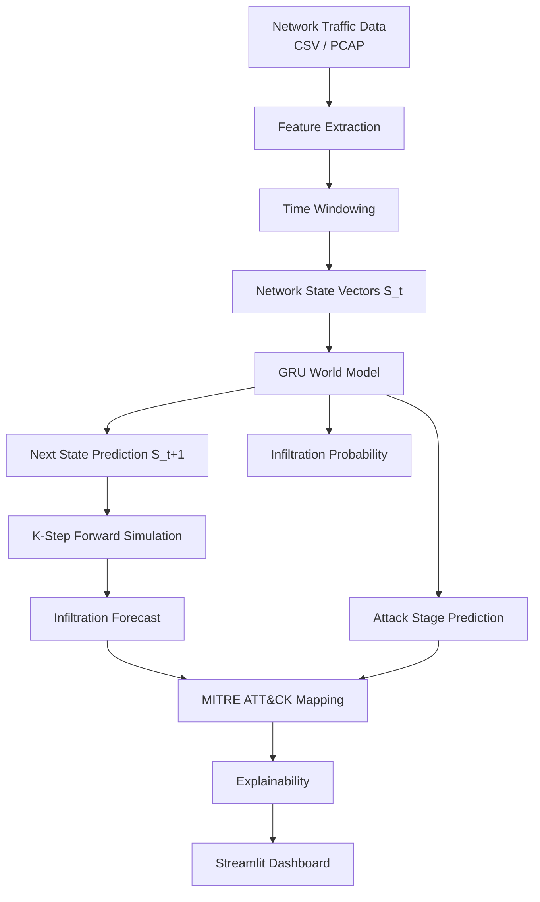

# 🛡️ Network Attack Forecasting — World Model

> **AI-based cybersecurity platform that learns network state transition dynamics and predicts future attack progression using a GRU-based World Model.**

This is NOT a traditional intrusion detection classifier. The system treats attacks as **evolving processes**, learning **P(S_{t+1} | S_t)** — the probability of the next network state given the current state — and recursively simulating future network states to forecast attack escalation.

## 📋 Problem Statement

Traditional IDS/IPS systems classify individual network flows as benign or malicious. They cannot:
- **Predict** what happens next in an attack sequence
- **Forecast** how far an attacker will progress
- **Simulate** future network states

Our system solves this by learning temporal state-transition dynamics and performing K-step forward simulation to forecast attack progression and map predicted behaviour to MITRE ATT&CK stages.

## 🏗️ Architecture



### World Model Architecture

```
Input: (batch, seq_len, num_features)
         │
    ┌────▼────┐
    │ State   │  Dense → ReLU → Dropout
    │ Encoder │  Projects raw features to latent space
    └────┬────┘
         │
    ┌────▼────┐
    │   GRU   │  2-layer GRU learns temporal dynamics
    │         │  Captures state-transition patterns
    └────┬────┘
         │
    ┌────▼────────────────────────────────┐
    │         Latent State h_T            │
    └──┬──────────┬──────────────┬────────┘
       │          │              │
  ┌────▼────┐ ┌──▼───┐   ┌─────▼─────┐
  │ Next    │ │Infil.│   │  Attack   │
  │ State   │ │Prob. │   │  Stage    │
  │(regress)│ │(σ)   │   │(softmax) │
  └─────────┘ └──────┘   └──────────┘
```

## 🚀 Quick Start

### 1. Install Dependencies

```bash
cd network_attack_forecasting
pip install -r requirements.txt
```

### 2. Generate Synthetic Demo Data

```bash
python data/generate_synthetic.py --records 10000
```

### 3. Train the World Model

```bash
python -m src.training.train --data data/sample/synthetic_traffic.csv
```

### 4. Launch the Dashboard

```bash
streamlit run app.py
```

## 📁 Project Structure

```
network_attack_forecasting/
├── app.py                          # Streamlit dashboard
├── config/config.yaml              # All configuration
├── data/
│   ├── generate_synthetic.py       # Synthetic data generator
│   └── sample/                     # Sample datasets
├── src/
│   ├── data/
│   │   ├── dataset_loader.py       # CSV ingestion + schema detection
│   │   ├── feature_extractor.py    # Flow/TCP/temporal/attack features
│   │   ├── preprocessor.py         # Scaling, label mapping
│   │   ├── pcap_processor.py       # PCAP → canonical format
│   │   └── time_windowing.py       # State vector construction
│   ├── models/
│   │   ├── world_model.py          # GRU World Model (PyTorch)
│   │   ├── state_encoder.py        # Dense feature encoder
│   │   └── forecasting_engine.py   # K-step recursive simulation
│   ├── training/
│   │   ├── train.py                # End-to-end training pipeline
│   │   ├── trainer.py              # Multi-task training loop
│   │   └── evaluate.py             # Model evaluation
│   ├── explainability/
│   │   └── explainer.py            # Feature perturbation / IG
│   ├── attack_mapping/
│   │   └── mitre_mapper.py         # MITRE ATT&CK stage mapping
│   ├── baseline/
│   │   └── logistic_regression.py  # Static baseline comparison
│   └── utils/
│       ├── helpers.py              # Config, seeds, I/O
│       ├── logger.py               # Structured logging
│       └── metrics.py              # Evaluation metrics
└── tests/
```

## 🔮 K-Step Forward Simulation

The core innovation: given observed states [S_{t-n}, ..., S_t], the engine:
1. Predicts S_{t+1} using the world model
2. Appends S_{t+1} to the context, drops the oldest state
3. Predicts S_{t+2} from the updated context
4. Repeats K times

Each step produces an infiltration probability and predicted MITRE ATT&CK stage. Confidence decays over steps to reflect compounding prediction uncertainty.

## 🗺️ MITRE ATT&CK Mapping

| Stage | MITRE ID | Description |
|-------|----------|-------------|
| 0 - Normal | N/A | Normal network activity |
| 1 - Reconnaissance | TA0043 | Port scanning, service probing |
| 2 - Initial Access | TA0001 | Brute force, exploit delivery |
| 3 - Lateral Movement | TA0008 | Internal scanning, credential reuse |
| 4 - Command & Control | TA0011 | Beaconing, DNS tunnelling |
| 5 - Exfiltration | TA0010 | Data extraction |

**Note**: Dataset labels are mapped to ATT&CK stages via heuristic rules. This is documented as an approximation, not ground truth.

## 🧠 Explainability

Feature perturbation importance measures how each feature contributes to infiltration risk by zeroing features and measuring prediction change. Template-based narratives are generated without external LLMs.

## 📊 Baseline Comparison

A Logistic Regression baseline uses the same features but only the last timestep (no temporal context). This demonstrates the advantage of the temporal world model approach.

## ⚠️ Limitations

- MITRE ATT&CK stage mapping is heuristic — real mapping requires threat intelligence
- K-step predictions compound errors — confidence degrades over forecast horizon
- Synthetic demo data does not represent real-world attack patterns
- The model requires sufficient sequential attack data for meaningful temporal learning
- PCAP processing requires Scapy and may be slow on large captures

## 🔧 Future Improvements

- Transformer-based temporal backbone for longer-range dependencies
- Variational/probabilistic world model for uncertainty quantification
- Real-time streaming ingestion from network taps
- Integration with SIEM/SOAR platforms
- Adversarial training for robustness
- Attention-based explainability over the temporal sequence
